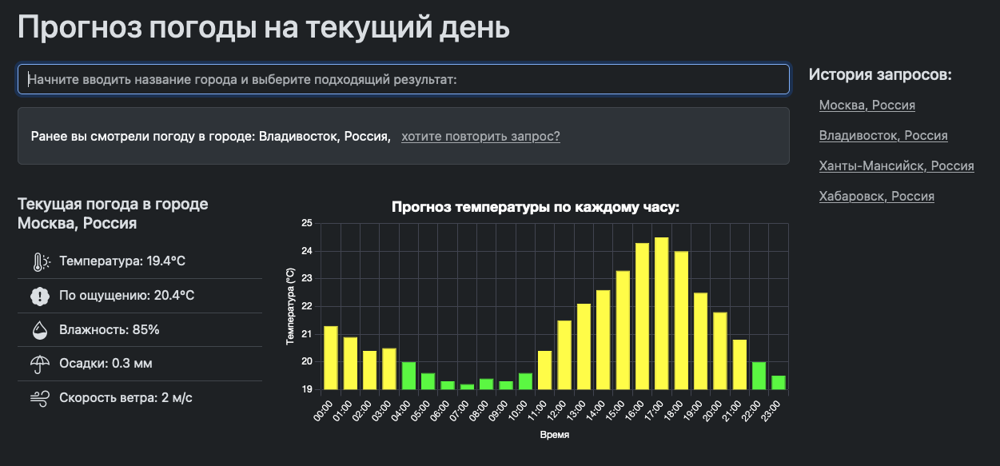

# Weather APP (тестовое задание)

Проект отображает прогноз погоды на текущий день по выбранному городу.



## Технологии

[](https://www.python.org/) [](https://fastapi.tiangolo.com/)
[](https://www.docker.com/) [](https://docs.pytest.org/en/latest/) 
## Описание

Проект отображает прогноз погоды на текущий день по выбранному городу, показывает по-часовую диаграмму изменения температуры, ведет историю запросов пользователя.
Для начала работы начните вписывать название города в поисковой строке и выберите один из найденных вариантов в выпадающем списке во время ввода.
API для работы проекта любезно предоставленные сервисом https://open-meteo.com/

- После запуска сервис доступен по адресу http://0.0.0.0:8000/
- Сохранение пользовательской сессии и истории запросов производится в Local Storage
- Сохранение статистики по поиску городов с количеством поисковых запросов производится в файл history.json и доступно для отображения по следующему эндпоинту:
```http://0.0.0.0:8000/history```

## Что реализованно
- ввод/вывод данных о погоде
- работа с api https://open-meteo.com/
- сделаны автодополнение (подсказки) при вводе города
- при повторном посещении будет предложено посмотреть погоду в городе, в котором пользователь уже смотрел ранее
- сохраняется история поиска для каждого пользователя
- реализован эндпоинт, показывающей сколько раз вводили какой город

## Установка
- Для начала работы с проектом клонируйте репозиторий
  - ```git clone https://github.com/NickolayBabulich/weather_app.git```
- Произвести установку Docker (https://docs.docker.com/get-docker/)
- Запуск проекта производится командой ```docker compose up```
- После сборки контейнера приложение будет доступно по адресу http://0.0.0.0:8000/
